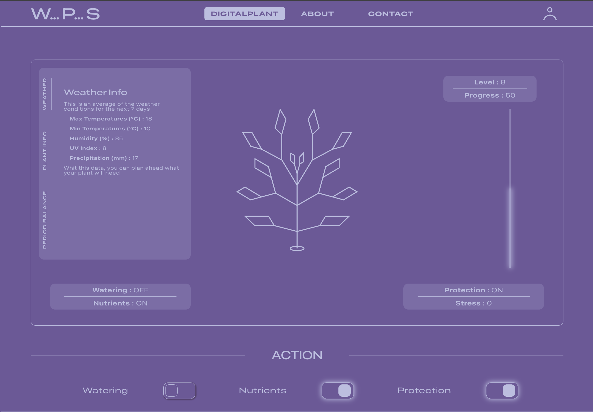

# Digital Plant Web App

> A full-stack web application for tracking digital plants, clients, and plant types.



## Overview

This repository contains a two-part web application: a Node.js back-end (REST API) and a React front-end built with Vite. The app creates an interactive digital plant experience where users manage clients and digital plants while experiencing dynamic, real-time feedback. The system integrates live weather data fetched from a weather API based on user geolocation, combining environmental conditions with plant-specific data and user actions to create a responsive, engaging interface. User interactions—such as plant care actions—directly influence the visual representation and state of the digital plants alongside real-world weather conditions.

## Features

- **Interactive Digital Plant Management** — Create, read, update, and delete plants with real-time state updates
- **Real-Time Weather API Integration** — Fetch live weather data based on user geolocation to provide contextual environmental information
- **Dynamic User Interactions** — User actions directly impact plant state visualization; combined with weather data to inform plant display and health indicators
- **Client & Admin Management** — Full CRUD operations for managing users and administrators
- **Responsive Dashboard** — Front-end views that dynamically render based on plant data, user input, and weather conditions
- **Geolocation Services** — Automatic location detection to fetch localized weather data and personalize the user experience

## Tech Stack

- Front-end: React, Vite, JavaScript, ESLint
- Back-end: Node.js, Express (controllers, routes, models)
- Database: MongoDB (Mongoose-style models present in `models/` — adjust if you use another DB)
- External APIs: Weather API (for real-time weather data fetching)
- Geolocation: Browser-based geolocation API for user location tracking
- Tools: npm, Vite, ESLint

## API Routes (examples)

The project includes route files for core resources. Confirm actual route prefixes in the route files.

- `/admins` — admin-related endpoints ([back-end/routes/adminsRoute.js](back-end/routes/adminsRoute.js))
- `/clients` — client endpoints ([back-end/routes/clientsRoute.js](back-end/routes/clientsRoute.js))
- `/plants` — plant endpoints ([back-end/routes/plantsRoute.js](back-end/routes/plantsRoute.js))

Front-end components leverage these endpoints and external weather APIs to deliver real-time updates to the dashboard.

## Local Setup

Prerequisites:

- Node.js (v16+ recommended)
- npm
- MongoDB (if the app uses MongoDB)

Install and run back-end:

```bash
cd back-end
npm install
# Start the server (pick the appropriate script present in package.json)
npm run dev || npm start
```

Install and run front-end:

```bash
cd front-end
npm install
# Start Vite dev server
npm run dev || npm start
```

Open the front-end (usually at `http://localhost:3000` or the address shown by Vite) and ensure the back-end API is running on its configured port.

## How It Works

### User Interaction Flow

1. **User Actions** — Users interact with digital plants (e.g., watering, adding nutrients) via the front-end interface
2. **Geolocation Detection** — The app detects user location using browser geolocation API
3. **Weather Data Fetching** — Real-time weather data is fetched from an external weather API based on user location
4. **State Integration** — Plant state, weather conditions, and user actions are combined to dynamically update the interface

This creates an immersive experience where environmental factors and user care directly influence plant outcomes, encouraging engagement and dynamic exploration.

## Environment Variables

Create a `.env` file in `back-end` (and `front-end` if needed) with values such as:

- `MONGODB_URI` — database connection string
- `PORT` — back-end server port
- `FRONTEND_PORT` — front-end dev server port (optional)
- `JWT_SECRET` — authentication secret 

Adjust names to match what's read in your code.

## Key Components

- **[Weather.jsx](front-end/src/components/Weather.jsx)** — Displays real-time weather data fetched from the weather API
- **[GeoLocation.jsx](front-end/src/components/GeoLocation.jsx)** — Handles geolocation detection and user location tracking
- **[DigitalPlant.jsx](front-end/src/views/DigitalPlant.jsx)** — Core plant view that integrates user actions, weather data, and plant state
- **[Balance.jsx](front-end/src/components/Balance.jsx)** & **[Action.jsx](front-end/src/components/Action.jsx)** — Manage user interactions and plant care actions

## Authors
- Project maintained by the authors listed in the repository.

---
